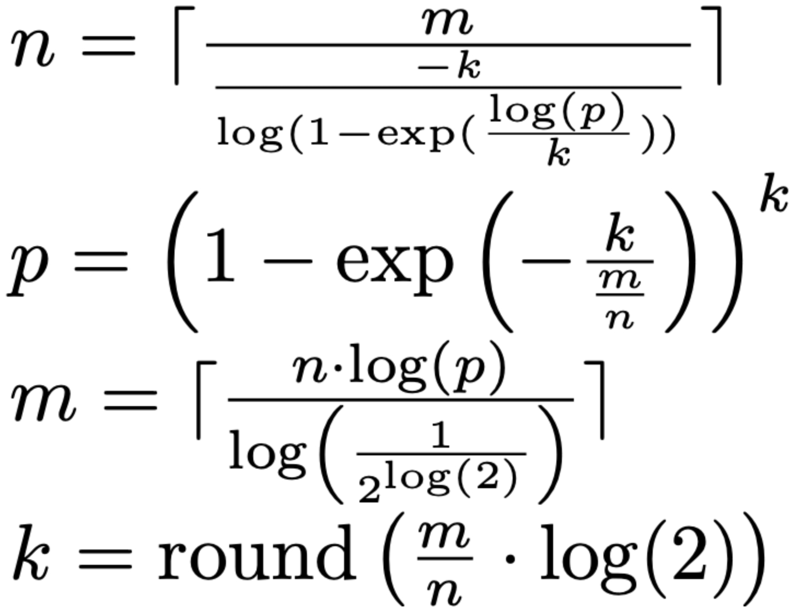

# Bloom Filter Overview
A Bloom filter is a probabilistic set membership structure that tracks whether elements have been seen. It guarantees no false negatives while allowing a tunable false positive rate. This script ingests user IDs, hashes each with a double-hashing scheme derived from SHA-256, and flips the corresponding bits in a large bytearray to record check-ins.

## Mathematical Basis


# Bloom Filter Usage
## CLI mode
```bash
python3 Blockchain/Bloom_Filter.py 123a 123a 456lin
```
## Interactive mode
```text
python3 Blockchain/Bloom_Filter.py
Enter IDs one per line (type 'confirm' to finish):
ID> 123a
ID> 123a
ID> 456fish
ID> confirm
```
Sample output:
```text
123a: checked in
123a: already present
456fish: checked in
```

